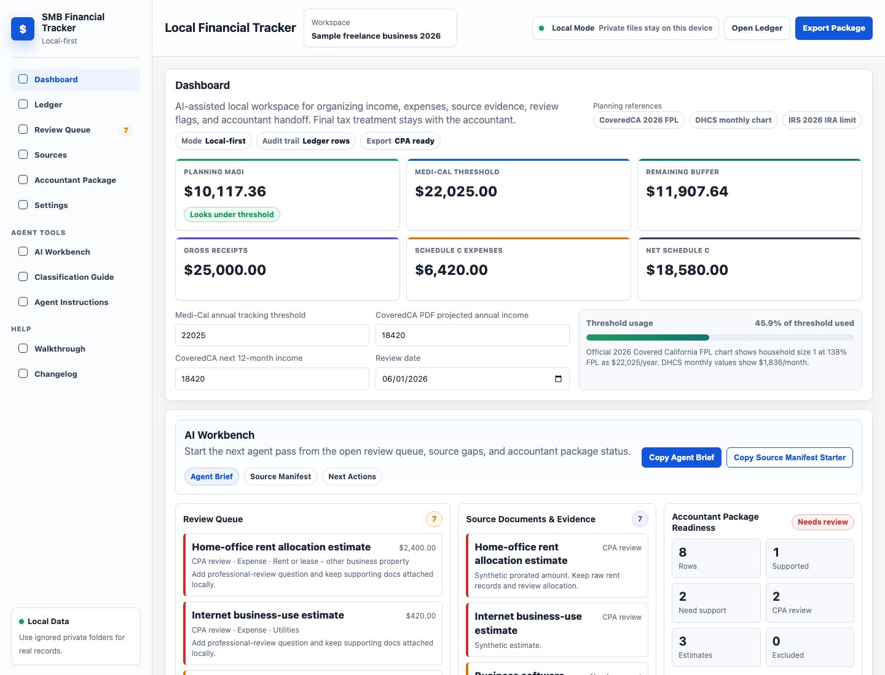

# SMB Financial Tracker

[](https://github.com/XKYLAN-LLC/smb-financial-tracker/actions/workflows/ci.yml)
[](LICENSE)
[](docs/project-status.md)
[](docs/private-data.md)

SMB Financial Tracker is an AI-assisted, local-first financial tracking surface for freelancers, consultants, and small business owners.

It gives a user and an AI assistant a shared place to maintain a simple ledger, source-document references, review flags, planning settings, and accountant-ready exports. Private financial records stay local. Public repo data stays synthetic.

This is not tax, legal, benefits, insurance, accounting, or financial advice. It is a recordkeeping and review tool.

## Preview



See the [walkthrough](docs/walkthrough.md) and synthetic [video workflow](docs/assets/video/README.md).

## Quick Start

Run the static dashboard locally:

```bash
python3 -m http.server 8765 --bind 127.0.0.1
```

Then open:

```text
http://127.0.0.1:8765/index.html
```

The UI reads saved browser state first, then falls back to `sample-tracker.seed.json`. Use Reset in the dashboard, or clear the `local-financial-tracker-v1` localStorage key, to reload the synthetic sample data.

## What This Provides

- Static local app-shell dashboard for income, expenses, deductions, review items, P&L, source evidence, and planning scenarios.
- Action Center that turns ledger rows into a review queue, evidence gap list, agent brief, and source-manifest starter.
- Plain JSON seed data that is easy for humans and agents to inspect.
- Source-document and accountant-package manifest examples.
- Agent instructions for preserving provenance, flagging uncertainty, and keeping private data out of Git.
- Validation scripts and CI checks for public examples.
- Privacy docs and ignored local folders for real work.

## Framework Surface

The project intentionally focuses on the surface an AI assistant can work with:

| Surface | Purpose |
|---|---|
| Ledger rows | Reviewable income, expense, transfer, owner contribution, and owner draw records. |
| Review statuses | Keep missing support, CPA questions, info-only items, and exclusions visible. |
| Action Center | Prioritize review work and copy an agent brief or source-manifest starter. |
| Source manifests | Track local-only PDFs, CSVs, receipts, statements, invoices, and notes by safe IDs. |
| Accountant packages | Collect exports, source checklists, and open questions into one local handoff. |
| Program configs | Store cited planning thresholds with effective dates. |
| Agent skills | Give assistants clear rules for privacy, provenance, and conservative review. |

The repo should not spend early effort on live integrations or heavy parsing logic. Users can attach CSVs, PDFs, and other documents to an AI session or place them under ignored `private/` folders; the durable output is reviewable rows, source references, and package checklists.

## Documentation

- [Docs index](docs/README.md)
- [Core concepts](docs/concepts.md)
- [AI agent surface](docs/agent-surface.md)
- [Agent workflows](docs/agent-workflows.md)
- [Classification guide](docs/classification.md)
- [Private data rules](docs/private-data.md)
- [Data model](DATA_MODEL.md)
- [Agent guide](AGENT_GUIDE.md)
- [Accountant package](docs/accountant-package.md)
- [AI prompts](docs/ai-prompts.md)
- [Roadmap](docs/roadmap.md)
- [Project status](docs/project-status.md)

## Key Files

| File | Purpose |
|---|---|
| `index.html` | Local static dashboard. |
| `sample-tracker.seed.json` | Synthetic seed ledger and settings. |
| `covered-ca-medi-cal-ca-2026.program.json` | Cited program threshold config. |
| `examples/` | Synthetic agent workspace and accountant-package manifests. |
| `skills/` | Agent skill instructions. |
| `scripts/` | Validation and screenshot capture scripts. |
| `docs/` | Product, privacy, agent, walkthrough, and roadmap docs. |
| `AGENTS.md` | Short repo instructions for AI coding agents. |

## AI-Assisted Workflow

1. Put private PDFs, CSVs, receipts, statements, invoices, and exports under ignored local folders in `private/`.
2. Ask an AI assistant to review those files with you and update local ledger rows, source manifests, and review flags.
3. Use the business profile and classification policy to keep categories, business-use percentages, and review statuses consistent.
4. Keep uncertain treatment marked with `Needs support`, `CPA review`, `Exclude`, or row type `Info only`.
5. Use the dashboard to review totals and export local accountant materials.
6. Keep generated package files and raw documents out of Git.

See [AI prompts](docs/ai-prompts.md) for copyable prompts.

## Validation

Run these before committing public data or agent-surface changes:

```bash
python3 scripts/validate-sample-json.py
python3 scripts/validate-agent-surface.py
python3 -m py_compile scripts/validate-sample-json.py scripts/validate-agent-surface.py
node --check scripts/capture-screenshots.mjs
node --check scripts/smoke-dashboard-buttons.mjs
node scripts/smoke-dashboard-buttons.mjs
git diff --check
```

For publication work, also run a targeted privacy scan and inspect the diff manually for raw imports, generated exports, screenshots, PDFs, backups, private records, account-like numbers, emails, phone numbers, and live keys.

To regenerate public screenshots from synthetic data:

```bash
node scripts/capture-screenshots.mjs
```

## Privacy

Do not commit:

- SSNs, tax IDs, account numbers, addresses, phone numbers, emails, or application IDs.
- Bank, brokerage, insurance, benefits, tax, payment-processor, or health-care records.
- Private PDFs, screenshots, CSV exports, spreadsheets, statements, receipts, or tax returns.
- Secrets, tokens, cookies, credential files, or private seed data.

Use ignored local folders under `private/` for real work. See [private data rules](docs/private-data.md).

## Contributing

Contributions should be small, practical, and public-safe. Good first improvements include docs, synthetic examples, validation, dashboard usability, and accountant-handoff workflow refinements.

Read [CONTRIBUTING.md](CONTRIBUTING.md), [SECURITY.md](SECURITY.md), and [SUPPORT.md](SUPPORT.md) before opening an issue or pull request.

## License

MIT. See [LICENSE](LICENSE).
