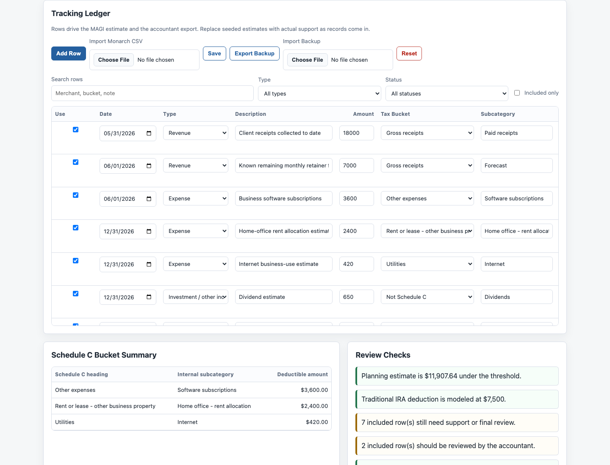
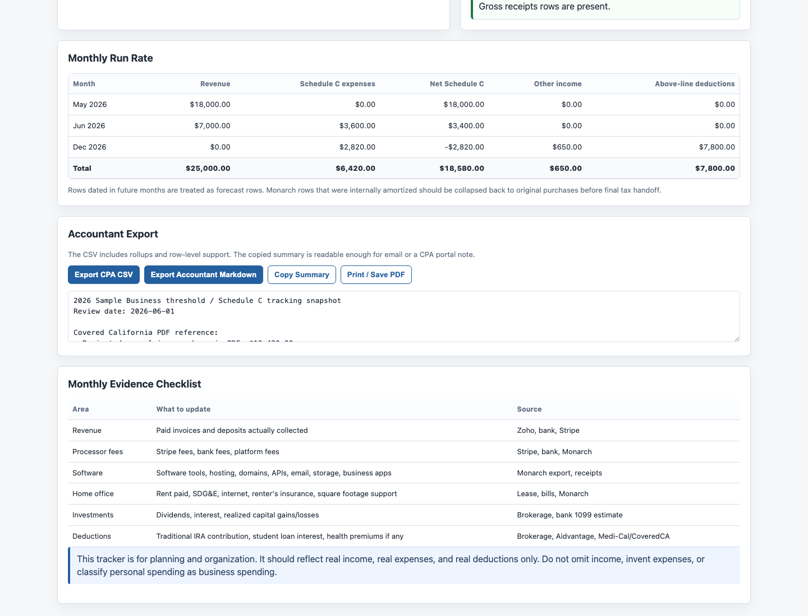

# Walkthrough

This walkthrough uses only synthetic sample data. Real business records, source documents, exports, and backups should stay under ignored local folders such as `private/`.

Short video walkthrough: [`assets/video/smb-financial-tracker-walkthrough.mp4`](assets/video/smb-financial-tracker-walkthrough.mp4)

## 1. Open The Local Dashboard

Run a local server:

```bash
python3 -m http.server 8765 --bind 127.0.0.1
```

Open `http://127.0.0.1:8765/index.html`.


The top of the dashboard shows planning income, threshold buffer, gross receipts, expenses, and net Schedule C estimate.

## 2. Review The Ledger



Ledger rows are the shared surface between the user and the AI assistant. The assistant can help update descriptions, buckets, support notes, source references, and review statuses from user-provided context.

Keep uncertain items visible:

- `Needs support` for missing receipts, statements, or business-purpose notes.
- `CPA review` for home office, vehicle, capitalization, mixed-use, meals, travel, or tax judgment.
- `Info only` for source records that should not affect totals yet.
- `Exclude` for transfers, duplicates, reimbursements, or personal records.

## 3. Track The Accountant Package

Use `examples/agent-workspace.example.json` and `examples/accountant-package.example.json` as the public synthetic shapes for local manifests.

In a real workflow, an AI assistant can help maintain:

- a private source-document checklist;
- a review queue;
- package contents;
- open accountant questions;
- final export status.

See `docs/accountant-package.md` for the local folder pattern.

## 4. Export Review Materials



The dashboard can export a CPA CSV and accountant Markdown summary. Those generated files should go under `private/exports/`, not Git.

## 5. Validate Before Publishing

Run:

```bash
python3 scripts/validate-sample-json.py
python3 scripts/validate-agent-surface.py
```

Then run a targeted privacy scan before committing public changes.
